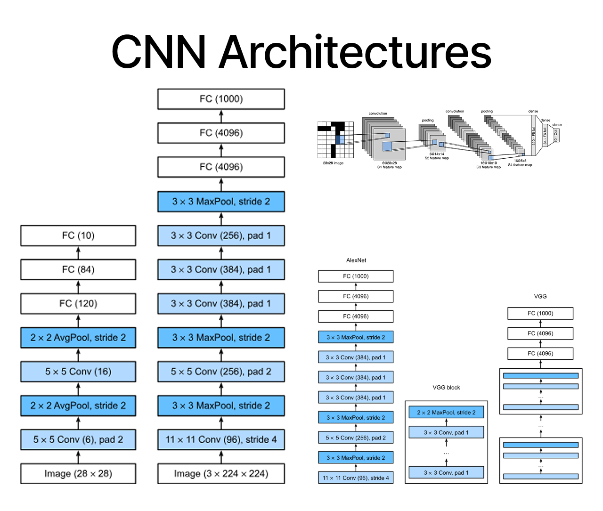

# CNN Architectures

  

This Project Provides Minimal, Standalone Implementations of Popular Convolutional Neural Network (CNN) Architectures That Can Be Imported And Used Independently.

Built With PyTorch And TensorFlow, The Collection Is Lightweight, Easy To Understand, And Designed For Learning, Experimentation, And Integration Into Larger Deep Learning Projects.

**Included Architectures:**
- LeNet-5
- AlexNet
- VGGNet
- ResNet
- DenseNet